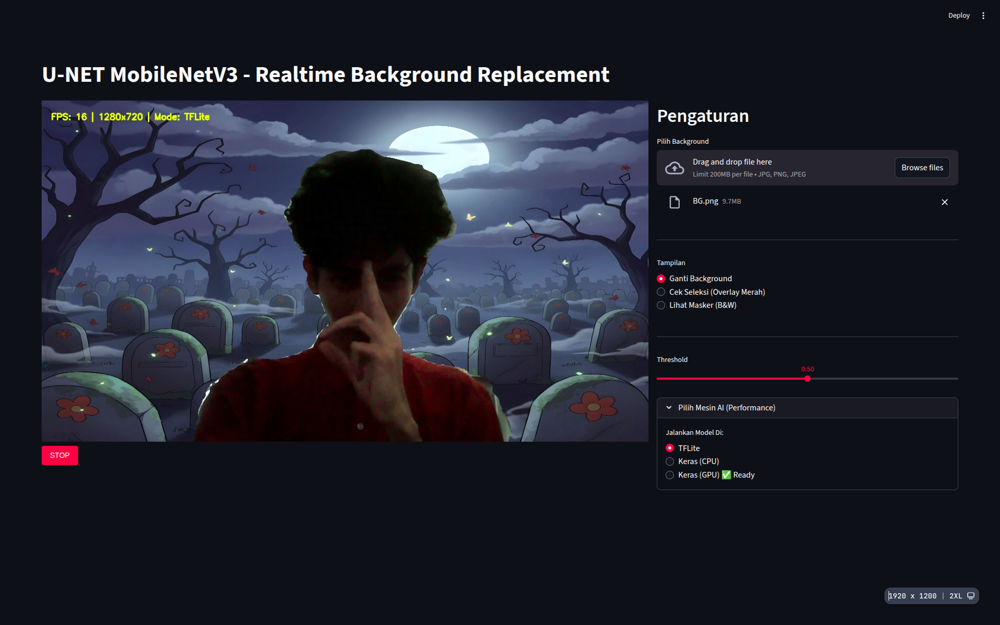
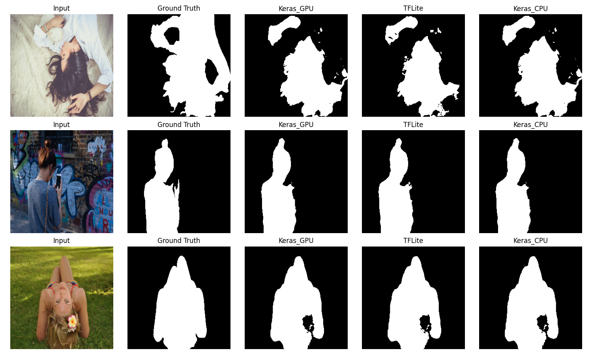
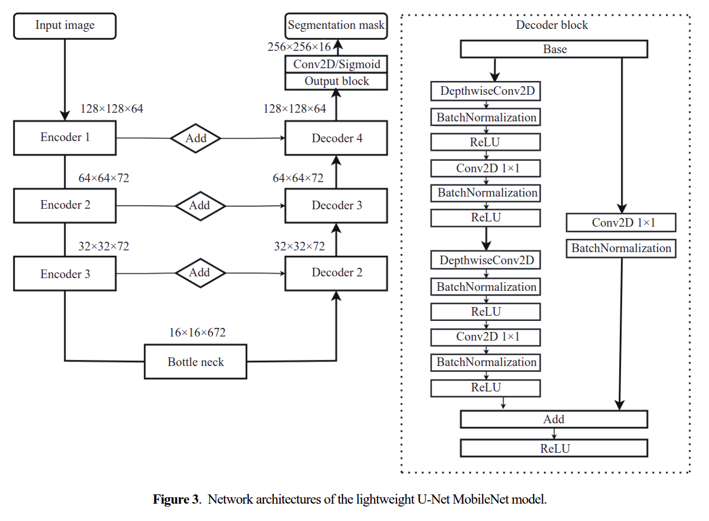

# Real-Time Background Replacement (U-Net MobileNetV3)


Proyek ini mengimplementasikan sistem penggantian latar belakang (*Virtual Background*) secara *real-time* untuk video conferencing berbasis web.

Model segmentasi dibangun menggunakan arsitektur **U-Net** dengan backbone **MobileNetV3-Large**, yang secara khusus dirancang untuk efisiensi tinggi pada perangkat dengan sumber daya komputasi terbatas (seperti Laptop tanpa GPU diskrit atau Edge Devices).

---

## Fitur Utama

*   **Real-Time Inference:** Mampu mencapai **~158 FPS** menggunakan model TFLite Quantized.
*   **Custom Background:** Pengguna dapat mengunggah gambar latar belakang sendiri.
*   **Adjustable Threshold:** Slider untuk mengatur sensitivitas pemisahan background/foreground.
*   **Debug Mode:** Visualisasi *Red Overlay* atau *Black & White Mask* untuk analisis model.

---

## Antarmuka Pengguna (UI)

Berikut adalah tampilan antarmuka aplikasi saat dijalankan di browser:


*(Tampilan Streamlit dengan fitur upload background dan kontrol threshold)*

---

## Referensi Paper

Metodologi proyek ini mengacu pada pendekatan *Lightweight U-Net MobileNet* yang dijelaskan dalam:

> **Kiran Shahi, and Yongmin Li.** (2023). *Background Replacement in Video Conferencing*. International Journal of Network Dynamics and Intelligence.
>
> *Abstract:* Studi ini membandingkan U-Net standar dengan U-Net berbasis MobileNet untuk segmentasi semantik yang efisien guna memisahkan foreground dan background secara real-time.

---

## Performa & Benchmark

Pengujian dilakukan untuk membandingkan efisiensi antara model **Keras (.keras)** standar dengan model **TFLite (.tflite)** yang telah dikuantisasi.

### Spesifikasi Perangkat
*   **CPU:** AMD Ryzen 5 6600H
*   **RAM:** 16 GB
*   **OS:** Ubuntu 22

### Hasil Benchmark
Dataset Validasi (Ukuran citra: 256x256):

| Model Mode | Dice Coef (Akurasi) | Dice Loss | Avg Inference Time | FPS | Model Size |
| :--- | :---: | :---: | :---: | :---: | :---: |
| **TFLite (Quantized)** | **0.9002** | **0.0998** | **6.32 ms** | **158.2** | **1.08 MB** |
| Keras (GPU) | 0.9029 | 0.0971 | 96.16 ms | 10.4 | 11.7 MB |
| Keras (CPU) | 0.9029 | 0.0971 | 120.09 ms | 8.3 | 11.7 MB |

### Analisis Hasil
1.  **Kecepatan:** Model **TFLite** unggul signifikan dengan capaian **~158 FPS**, menjadikannya satu-satunya pilihan layak untuk aplikasi *real-time*.
2.  **Ukuran:** Kompresi TFLite mereduksi ukuran model hingga **10x lebih kecil** (11.7 MB $\rightarrow$ 1.08 MB).
3.  **Akurasi:** Penurunan akurasi akibat kuantisasi sangat kecil (hanya 0.0027 poin pada Dice Coef) dan hampir tidak terlihat secara visual.
4.  **Catatan GPU:** Pada inferensi *single-image* (batch=1), CPU (via TFLite) lebih cepat daripada GPU karena *overhead* transfer memori (RAM ke VRAM) pada GPU lebih besar daripada waktu komputasinya.

### Visualisasi Komparasi


---

## Arsitektur Model

Sistem menggunakan arsitektur **Encoder-Decoder** (U-Net):

1.  **Encoder (Backbone):** **MobileNetV3-Large** (pre-trained ImageNet). Bertugas mengekstrak fitur gambar. Layer spesifik diambil untuk *skip connections*.
2.  **Decoder:** Blok **Residual Decoder** kustom. Bertugas merekonstruksi masker segmentasi dengan menggabungkan informasi spasial dari encoder untuk detail tepian (rambut, jari, dll) yang lebih baik.



---

## Alur Pengembangan

Detail proses training dapat dilihat pada notebook `PCD_Akhir.ipynb`.

1.  **Dataset:** Kaggle Person Segmentation (nikhilroxtomar).
2.  **Preprocessing:** Resize ke 256x256, normalisasi.
3.  **Augmentasi (Albumentations):**
    *   *Coarse Dropout:* Simulasi oklusi/gangguan objek.
    *   *Channel Shuffle, Rotation, Flip:* Meningkatkan generalisasi model.
4.  **Loss Function:** Hybrid (**Binary Cross Entropy + Dice Loss**).
5.  **Optimisasi:** Konversi model Keras ke TFLite dengan **Default Quantization** untuk CPU inference yang cepat.

---

## Cara Menjalankan

### 1. Persiapan Environment
Pastikan Python 3.9 - 3.11 terinstall. Disarankan menggunakan Virtual Environment.

Buat file `requirements.txt`:
```text
streamlit
streamlit-webrtc
opencv-python-headless
tensorflow
ai-edge-litert
numpy
pandas
matplotlib
scikit-learn
Pillow
av
```

Install dependencies:
```bash
pip install -r requirements.txt
```

### 2. Menjalankan Aplikasi
Pastikan file model (`model_quantized.tflite`) berada di folder yang sama dengan `app.py`.

```bash
streamlit run app.py
```

### 3. Struktur Folder
```text
.
├── PCD_Akhir.ipynb              # Notebook training & evaluasi
├── app.py                       # Aplikasi utama (Streamlit)
├── benchmark_script.py          # Script benchmarking
├── best_model_fixed.keras       # Model Full Precision (Backup)
├── model_quantized.tflite       # Model Optimized (Digunakan App)
├── benchmark_results.csv        # Log hasil benchmark
└── dataset/                     # Folder dataset
```

---

## Known Issues

**Resolusi Kamera di Browser (Chrome/Chromium)**
Jika aplikasi dijalankan pada konteks yang tidak aman (`http://` biasa), Chrome membatasi resolusi kamera maksimal 640x480 atau lebih rendah demi keamanan privasi.
> *Solusi:* Abaikan saat development di localhost, atau deploy menggunakan HTTPS untuk resolusi penuh.
